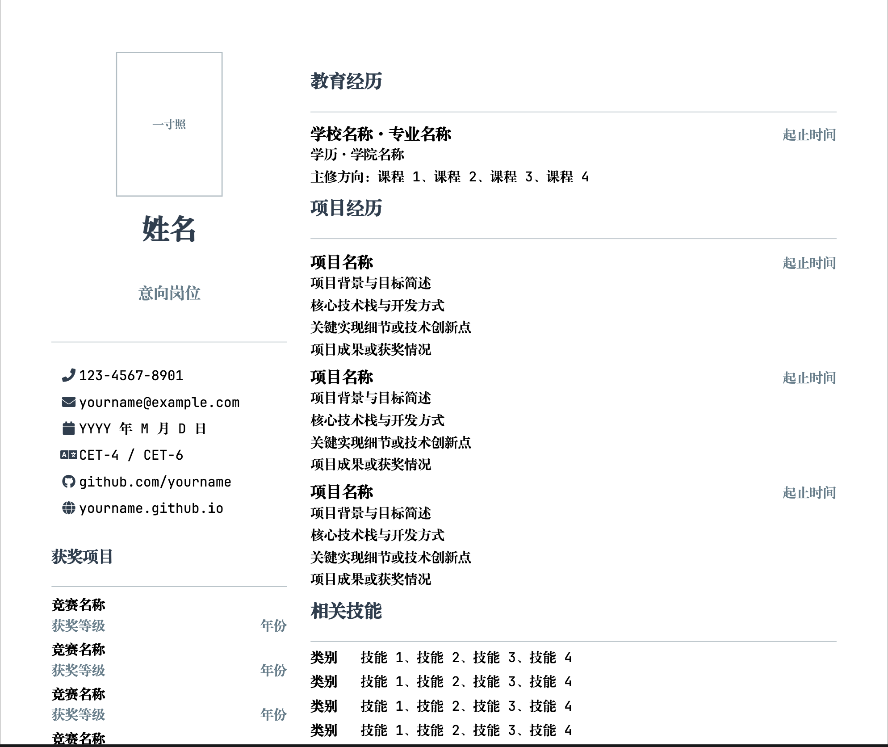

# 简历模板

[English](README_EN.md) | 中文

基于 XeLaTeX 的双栏中文简历模板。

## 预览




## 快速开始

### 环境要求

- TeX Live 2024+（需含 XeLaTeX）
- 所需字体：
  - `FZXiaoBiaoSong-B05S` — 方正小标宋
  - `JetBrainsMono Nerd Font` — 英文等宽字体

> **注意：** 如果没有以上字体，请安装或修改 `resume.cls` 第 25–26 行的字体名称。

### 编译

```bash
xelatex main.tex
```

### 自定义

编辑 `main.tex` 即可，所有个人信息均已标注。无需修改 `resume.cls`。

| 字段 | 命令 | 说明 |
|---|---|---|
| 照片 | `\photo{w}{h}[file]` | 加 `[photo.jpg]` 显示照片；省略则显示占位框 |
| 姓名 | `\name{...}` | 填写姓名 |
| 意向岗位 | `\position{...}` | 目标岗位 |
| 电话 | `\phone{...}` | 手机号码 |
| 邮箱 | `\email{...}` | 邮箱地址 |
| 生日 | `\birth{...}` | 出生日期 |
| 英语等级 | `\cet{...}` | 英语水平（如 CET-4 / CET-6） |
| GitHub | `\github{...}` | GitHub 主页链接 |
| Blog | `\blog{...}` | 个人博客链接 |
| 获奖 | `\award{名称}{等级}{年份}` | 竞赛获奖条目 |
| 学校 | `\school{...}{...}` | 学校名称与就读时间 |
| 项目 | `\project{名称}{时间}` | 项目标题 |
| 技能 | `\skill{类别}{内容}` | 技能类别与具体内容 |
| 证书 | `\cert{...}` | 证书名称 |

## 文件结构

```
template/
├── main.tex      # 简历内容（修改此文件）
├── resume.cls    # 文档类（勿修改）
└── README.md     # 本文件
```

## 许可

MIT — 可自由用于个人或商业用途。
