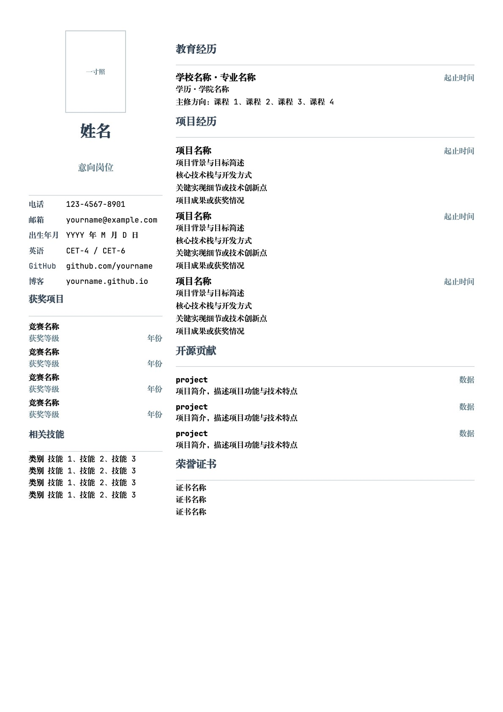

# Resume Template

English | [中文](README.md)

A two-column Chinese resume template built with XeLaTeX.

## Preview

[Preview Doc](main.pdf)



## Quick Start

### Prerequisites

- TeX Live 2024+ (with XeLaTeX)
- Required fonts:
  - `FZXiaoBiaoSong-B05S` — FangSong-style Chinese typeface
  - `JetBrainsMono Nerd Font` — English monospace font

> **Note:** If you don't have these fonts, either install them or replace the font names in `resume.cls` lines 25–26.

### Compile

```bash
xelatex main.tex
```

### Customize

Edit `main.tex` — all personal information is clearly marked. No need to modify `resume.cls`.

| Field | Command | Description |
|---|---|---|
| Photo | `\photo{w}{h}[file]` | Add `[photo.jpg]` for photo; omit for placeholder |
| Name | `\name{...}` | Your full name |
| Position | `\position{...}` | Target job title |
| Phone | `\phone{...}` | Phone number |
| Email | `\email{...}` | Email address |
| Birth | `\birth{...}` | Date of birth |
| CET | `\cet{...}` | English proficiency (e.g. CET-4) |
| GitHub | `\github{...}` | GitHub profile URL |
| Blog | `\blog{...}` | Personal blog URL |
| Award | `\award{name}{level}{year}` | Competition award entry |
| School | `\school{...}{...}` | School name and period |
| Project | `\project{name}{period}` | Project heading |
| Skill | `\skill{category}{items}` | Skill category and content |
| Certificate | `\cert{...}` | Certificate name |

## File Structure

```
template/
├── main.tex      # Resume content (edit this)
├── resume.cls    # Document class (do not edit)
└── README.md     # This file
```

## License

MIT — use freely for personal or commercial purposes.
